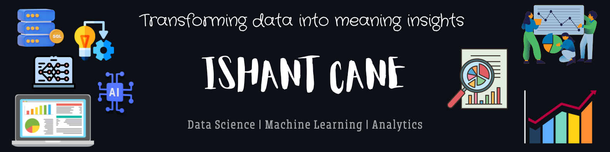

<!-- Header Banner -->

  

  

---

## 👋 About Me

🎓 **BSc Physical Science (Computers)**  
📊 Actively learning and building projects in **Data Science & Machine Learning**

- 🔭 Working on real-world ML & analytics problems  
- 📈 Interested in **Forecasting, Segmentation, Churn, CLV, Lead Scoring & Risk Modeling**  
- 🧠 Focus on understanding *why* a model works, not just results  
- 🎯 Long-term goal: **Professional Data Scientist/AI Engineer**

---

## 🧰 Tech Stack

### 💻 Programming & Data

  

### 📊 Data Science & ML
- Pandas, NumPy, Scikit-Learn  
- Matplotlib, Seaborn  
- Feature Engineering & Model Evaluation  
- Advanced Excel, Power BI (Dashboards & KPIs)

---

## 📌 Projects

### 🔹 Customer Churn & CLV Prediction
- Built churn prediction models using transactional data  
- Identified high-value customers at risk of silent attrition  
- Combined **CLV + churn probability** for better business decisions  

---

### 🔹 Lead Scoring System
- Developed ML-based lead scoring model  
- Evaluated performance beyond default accuracy  
- Used **precision-recall analysis & cutoff optimization**  
- Translated probabilities into actionable sales categories  

---

### 🔹 Uber Traffic Analysis
- Integrated traffic, weather & event datasets  
- Performed time-based analysis for demand patterns  
- Generated operational insights

---

## 📊 GitHub Stats

  
  

---

## 🌐 Connect With Me

  
  

---

  <em>“Data is useful only when it leads to better decisions.”</em>

  

